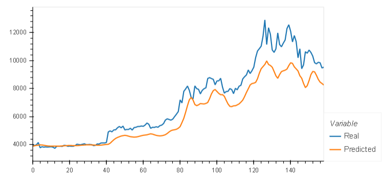
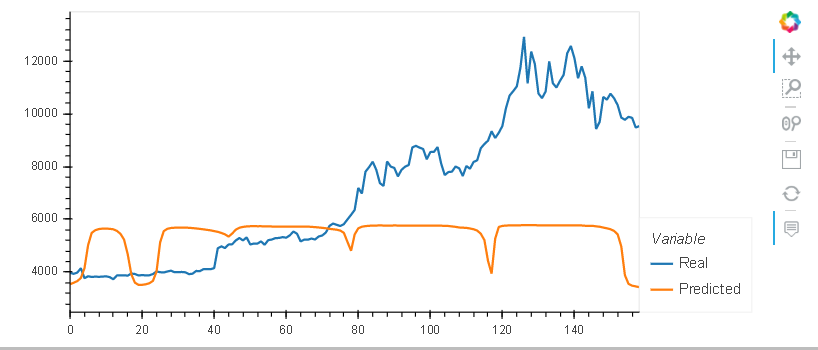

Deep learning recurrent neural networks were used to model bitcoin closing prices. One model used the FNG values to predict the closing price while the second model used a window of closing prices to predict the nth closing price. The two models were then compared and evaluated.

Conclusions:

The RNN LSTM model based on the closing prices had a lower loss than the model based on FNG values.

The RNN LSTM model based on closing prices tracked actual values better over time than the model based on FNG values.

Model based on closing prices with 14 day window:

Model based on fng values with 14 day window:

Windows from 1 to 15 were evaluated. The window with the lowest loss when evaluated against test data was a 14 day rolling average window. 